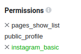

# facebook api request information
## link a instagram acccount
### requirements
- need a instagram creator account/buisiness (if less then 100 follows some features will be hidden)
- need a facebook page connected to the business/creator account

#### basic auth permissions

- this allows us to get account information for other requests


## insights api endpoint
[click here](https://developers.facebook.com/docs/instagram-api/guides/insights)

- this apparently shows that the id is invalid

### issues
- facebook just updated their api for v18 making it not work without business permissions(which is really hard to get).
[link to bug report](https://developers.facebook.com/support/bugs/602264498523167/)

- the request that instagram shows in the endpoint in there docs seems to be outdated means that id is wrong or unauthed
[talking about error](https://www.reddit.com/r/api_connector/comments/tqza66/getting_singular_published_story_api_is/)


#### expired tokens
- [  ] tokens expire quick, find a solution for this or accept the issue and come up with a work around


#### solution for API call
- from the looks of it you need to have a facebook account connected to your instagram to view its insights from grabbing their information from a sign in page.
- we also have to use a previous version v16 or v17 assuming they dont sunset them

    - adding(`business_management`) this to the permissions seems to output the correct data for v18 but was told its hard to get accepted for the permission that was added:
```json
{
  "data": [
    {
      "access_token": "!!!REMOVED!!!",
      "category": "School",
      "category_list": [
        {
          "id": "2601",
          "name": "School"
        }
      ],
      "name": "Test page",
      "id": "130076146861171",
      "tasks": [
        "ADVERTISE",
        "ANALYZE",
        "CREATE_CONTENT",
        "MESSAGING",
        "MODERATE",
        "MANAGE"
      ]
    }
  ],
  "paging": {
    "cursors": {
      "before": "QVFIUlM0dTJlcHItSGV3NHdPaHdZAZATFvc2E3ZAEljM0FlbWZAQOGJCNlBicWxXUHpyclpfUEtnaE5CeC1XWFpVS18zamRNOUtVSXdyR0VaOXZAnV0xtZAkd3eXJ3",
      "after": "QVFIUlM0dTJlcHItSGV3NHdPaHdZAZATFvc2E3ZAEljM0FlbWZAQOGJCNlBicWxXUHpyclpfUEtnaE5CeC1XWFpVS18zamRNOUtVSXdyR0VaOXZAnV0xtZAkd3eXJ3"
    }
  }
}
```


## getting user infromation steps request side

### information on facebook API
[it seems like this is the best choice for what we want to do](https://developers.facebook.com/docs/instagram-api)
This has a fair bit of information on how to use and mess with their API

[getting started](https://developers.facebook.com/docs/instagram-api/getting-started)
this is a good start if you want to mess with your own tokens. there are a few more things to do before you can use the it!

[simple guide to get most to work](https://www.youtube.com/watch?v=ZrgKHRDrVjE)
Note: instagram account has to be a business or content creator  
Note: when it asks for domains anywhere just put a domain, idk if you need a specific domain but 'euphoria.one' worked for me.

### getting started
1. make a facebook dev account
2. [create](https://developers.facebook.com/apps/creation/) a new app that is `other` and then `none` for app type. Give it any name and click next.
3. in the `app settings` -> `basic` add a app icon, privacy policy URL (any should work ex: http\://euphoria.one/)
4. scroll down and add a website in the `add platform`
5. follow the guide above to link the correct account stuff
6. go to [here](https://developers.facebook.com/tools/explorer/) for testing the API before implementing into code
  - the request below you DO NOT need to add the `?access_token={TOKEN}` to them since its premade in the explorer tool

### getting pages on facebook
```curl
$ curl -i -X GET "https://graph.facebook.com/v18.0/me/accounts?access_token={TOKEN}"
```
#### output
```json
{
  "data": [
    {
      "access_token": "!!!REMOVED!!!",
      "category": "School",
      "category_list": [
        {
          "id": "2601",
          "name": "School"
        }
      ],
      "name": "Test page",
      "id": "130076146861171",
      "tasks": [
        "ADVERTISE",
        "ANALYZE",
        "CREATE_CONTENT",
        "MESSAGING",
        "MODERATE",
        "MANAGE"
      ]
    }
  ],
  "paging": {
    "cursors": {
      "before": "QVFIUlM0dTJlcHItSGV3NHdPaHdZAZATFvc2E3ZAEljM0FlbWZAQOGJCNlBicWxXUHpyclpfUEtnaE5CeC1XWFpVS18zamRNOUtVSXdyR0VaOXZAnV0xtZAkd3eXJ3",
      "after": "QVFIUlM0dTJlcHItSGV3NHdPaHdZAZATFvc2E3ZAEljM0FlbWZAQOGJCNlBicWxXUHpyclpfUEtnaE5CeC1XWFpVS18zamRNOUtVSXdyR0VaOXZAnV0xtZAkd3eXJ3"
    }
  }
}
```
##### output parsing
- we need to get the `"id": "130076146861171"` to get our id for future requests
- i am assuming this is the ID for our page

### getting business account
```curl
curl -i -X GET \
 "https://graph.facebook.com/v18.0/me/accounts?fields=instagram_business_account&access_token={TOKEN}"
```
#### output
```json
{
  "data": [
    {
      "instagram_business_account": {
        "id": "17841459177727833"
      },
      "id": "130076146861171"
    }
  ],
  "paging": {
    "cursors": {
      "before": "QVFIUlM0dTJlcHItSGV3NHdPaHdZAZATFvc2E3ZAEljM0FlbWZAQOGJCNlBicWxXUHpyclpfUEtnaE5CeC1XWFpVS18zamRNOUtVSXdyR0VaOXZAnV0xtZAkd3eXJ3",
      "after": "QVFIUlM0dTJlcHItSGV3NHdPaHdZAZATFvc2E3ZAEljM0FlbWZAQOGJCNlBicWxXUHpyclpfUEtnaE5CeC1XWFpVS18zamRNOUtVSXdyR0VaOXZAnV0xtZAkd3eXJ3"
    }
  }
}
```
##### ouput
- this will get our id `"id": "17841459177727833"`(inner most) to be used in future request since this is our ID for the page

### insights stuff
- first thing we need to do get our page ID from our account
- then we need to go to `{ID}/?fields=access_token`
- this will give us our access token that we can now use to view insights
[here]("https://stackoverflow.com/questions/48707646/facebook-graph-api-190-this-method-must-be-called-with-a-page-access-token")
- TODO: figure out where to store the page access token since it gives an oATUH error atm

### inisghts and other information
#### IMPORTANT
- to get insights information, we need to add another permission `instagram_manage_insights`
    - this will make us have to regen the token if we dont include this at the beginning

#### simplistic stat examples
```curl
curl -i -X GET \
 "https://graph.facebook.com/v18.0/17841459177727833?fields=followers_count&access_token={TOKEN}"
```
#### output
```json
{
  "followers_count": 124,
  "id": "17841459177727833"
}
```

#### tags

- there seems to be a fair bit of information we can gather from this.

#### insights full example
- this is a bigger example of a insight grab using parameters from their api information
[click here for docs](https://developers.facebook.com/docs/instagram-api/guides/insights/)

```curl
curl -i -X GET \
 "https://graph.facebook.com/v18.0/17841459177727833/insights?metric=impressions%2Creach%2Cprofile_views%20%20%20%20%20&period=day&access_token={TOKEN}"
```

```json
{
  "data": [
    {
      "name": "impressions",
      "period": "day",
      "values": [
        {
          "value": 0,
          "end_time": "2023-10-03T07:00:00+0000"
        },
        {
          "value": 0,
          "end_time": "2023-10-04T07:00:00+0000"
        }
      ],
      "title": "Impressions",
      "description": "Total number of times the Business Account's media objects have been viewed",
      "id": "17841459177727833/insights/impressions/day"
    },
    {
      "name": "reach",
      "period": "day",
      "values": [
        {
          "value": 0,
          "end_time": "2023-10-03T07:00:00+0000"
        },
        {
          "value": 0,
          "end_time": "2023-10-04T07:00:00+0000"
        }
      ],
      "title": "Reach",
      "description": "Total number of times the Business Account's media objects have been uniquely viewed",
      "id": "17841459177727833/insights/reach/day"
    },
    {
      "name": "profile_views",
      "period": "day",
      "values": [
        {
          "value": 0,
          "end_time": "2023-10-03T07:00:00+0000"
        },
        {
          "value": 0,
          "end_time": "2023-10-04T07:00:00+0000"
        }
      ],
      "title": "Profile Views",
      "description": "Total number of users who have viewed the Business Account's profile within the specified period",
      "id": "17841459177727833/insights/profile_views/day"
    }
  ],
  "paging": {
    "previous": "https://graph.facebook.com/v18.0/17841459177727833/insights?access_token=EAAMI51H8X3wBOZCCsG8MZCUM33kgAcH12ZAPeUeIjk221pqplOfKdh451MyuCbNEo5ZAwRdKIWdJ43ZA2kGTwzsZCfyUGOsRq7YRlVUMto6yjb5YpbJHu1IXaizbLfxyG5j0GEY6ZCTcGOIbkgZCnl4ugTNs0TpHRurg0X0e6q4S1SzkCA2J4tviEObiW1QOENCM08yPuKLDXo0dTPD4mf125wk8mYXdeBaoOyVIiuDcnFUwvz3SsB1ypKUfZAC0a6ZASb4qRSl70ZD&pretty=0&metric=impressions%2Creach%2Cprofile_views+++++&period=day&since=1696112258&until=1696285058",
    "next": "https://graph.facebook.com/v18.0/17841459177727833/insights?access_token=EAAMI51H8X3wBOZCCsG8MZCUM33kgAcH12ZAPeUeIjk221pqplOfKdh451MyuCbNEo5ZAwRdKIWdJ43ZA2kGTwzsZCfyUGOsRq7YRlVUMto6yjb5YpbJHu1IXaizbLfxyG5j0GEY6ZCTcGOIbkgZCnl4ugTNs0TpHRurg0X0e6q4S1SzkCA2J4tviEObiW1QOENCM08yPuKLDXo0dTPD4mf125wk8mYXdeBaoOyVIiuDcnFUwvz3SsB1ypKUfZAC0a6ZASb4qRSl70ZD&pretty=0&metric=impressions%2Creach%2Cprofile_views+++++&period=day&since=1696457860&until=1696630660"
  }
}
```
## better way to visualize this data

### postman
Postman is an API platform for building and using APIs. Postman simplifies each step of the API lifecycle and streamlines collaboration so you can create better APIs—faster.

[download (binaries)](https://www.postman.com/downloads/)


#### using for project
1. copy one of the previous curl requests into the URL bar in postman and it will generate the request in a visual format


2. after getting a proper access_token you an click the send button to see the request in the lower half of the screen. This will allow the use of viewing the parts of the response. in my case my Key expired but will still show the same format


post man gives lots information about the full request such as the status in the top corner. We can also look at the other tabs to get view other formats of how it could be rendered.

3. future use of using postman. You can click on the code icon on the right side of postman in a request tab. this will allow you to generate code straight into the a language for the request. This can help with testing the request or importing it to a project.


## facebooks api wrapper
**THIS IS MORE FOR MY SAKE THEN THE PROJECT**
*I made this while cooked up on caffine and wanted to write out most of the stuff I did*


I do not know if we are allowed to use a premade library for this project so just encase I started a basic wrapper to get things going.

### getting started
This was tested and works for 
```
Python 3.11.4 (main, Jun 28 2023, 19:51:46) [GCC] on linux
```

1. get the required packages for the project
```sh
$ python3 -m pip install -r requirements.txt
```

2. add your code and token to main.py for quick testing
```py
import facebook as fb
token = 'XXXxxxXXX'

API = fb.facebook_API( token, fb.facebook_Config())
```

### conventions
1. Definitions
```py
# Functions should state a return type to make it easier to understand the reponse data
def some_function_name() -> return_type:
  '''
  Comments on what the function does
  '''
  pass
# params/args should also contain a type if possible to help
def some_other_function(arg1: str, arg2: object) -> return_type:
  '''
  Comments on what the function does
  '''
  pass
```

### API wrapper design
#### facebook (main)
facebook is the main file for the wrapper, this is what you want to import to your main or project to access the rest of the program. This inherits the parent class `request_base.py`

##### possible changes
since we want to make this something that is dynamic we may want to remove the token in it and create a function to change the function so that it can call and return from the same object instead of having to recreate the object for each token.

##### token
token is the current token that was added to the project. Just keep in mind that when you add the token to the class on the init it will also pass it to a params at the same time so just changing the token item is not enough to setup for a different token. you would need to change the token in the params file dictionary.

```py
self.required_params = {'access_token': self.token} # would also have to change this
```

##### \_\_init\_\_ and extension init
init will init the rest of the stuff we want for the object and parent classes. extensions(talked about later on) are also init in here to give the right data


##### extensions and their separate classes
extensions is a very important part to the api architecture. To separate requests to make it more ogranized api calls are stored in separate extension files. Example of this could be general where it is stored in `./api/extensions/general`. this folder contains multiple files. the main one `extensions.py`. Sub files are response classes that will hold data and potential functions related to the data.

##### extensions\.py
this file will hold api calls to help separate them into sections. A sideeffect of this also allows us to name give them better naming. we can now do things such as `API.general.get_me()` where general is added as the sideeffect. 

*/general/extension.py*
```py
class general:
    '''
    general extension for the facebook api wrapper
    '''
    request: request_base = None # our request base for easy typing

    # init our extension base
    def __init__(self, base: request_base) -> None:
        self.request = base

    def get_me(self) -> Me | RequestError:
        '''
        get the current user from facebook that the token is for
        '''
        return self.request.get(self.request.facebook_config.api_version + '/me', object_return_type=Me)
        
    # ... add more extensions here
```

this is a good example of a very basic extension where get_me is our extension function.

##### separate classes
the seperate classes involved in the extension folder allow us to use them as data classes. the data in these is the response JSON from the site. With this we can basically make python type safe in a sense. This will allow intelisense to pick up what data we can have in a object instead of us having to guess.


##### how the separate classes are generated
1. make a request using postman and copy the repsonse in JSON.
2. go to [JSON converter](https://json2csharp.com/code-converters/json-to-python)
  - this just makes it automated instead of manually having to write this each time we want to make a new reponse
3. paste the response on the left and click convert
4. once generated change the name of the `Root` object and add to a new file

###### example
if we have a response from a server that has:
```json
{
  "username": "test",
  "object_inside": {
    "some_number": 2
  },
}
```
we can copy this into the converter and convert
```py
from typing import Any
from dataclasses import dataclass
import json
@dataclass
class ObjectInside:
    some_number: int

    @staticmethod
    def from_dict(obj: Any) -> 'ObjectInside':
        _some_number = int(obj.get("some_number"))
        return ObjectInside(_some_number)

@dataclass
class Root:
    username: str
    object_inside: ObjectInside

    @staticmethod
    def from_dict(obj: Any) -> 'Root':
        _username = str(obj.get("username"))
        _object_inside = ObjectInside.from_dict(obj.get("object_inside"))
        return Root(_username, _object_inside)

# Example Usage
# jsonstring = json.loads(myjsonstring)
# root = Root.from_dict(jsonstring)
```

this output gives us an example of how to use. The only thing I change would be the name 'Root' to what we want to call this object. This is the item we would import to the other files.

lets say we keep the name as root just to keep it simple and want to get the request for this.
```py
return self.request.get(self.request.facebook_config.api_version + '/me', object_return_type=Root)
```
the way I have this request is that the object will be attempted to be returned as what `object_return_type` is. this will in this exmaple attempt to take the body of the request and return it into that object using the `from_dict()` function in the class. 


##### error\.py
error.py is the generic response if the response is failed so we want to have something that is sent back with so if it fails it can atleast create this class object and return it to the user

```py
    def get(self, endpoint: str, params: dict = {}, object_return_type: object = None) -> object | dict | RequestError:
        '''
        our get request method to help handle the requests
        this will send a get request to the url with the params added on the end
        
        endpoint: str - the endpoint to send the request to
        params: dict = {} - the params to add to the end of the url (eg. ?param1=value1&param2=value2)
        object_return_type: object = None - if we want to return an object instead of a dict, we can specify the object type here

        returns: object | dict | RequestError - the response from the request
        object if we have an object_return_type
        dict if we dont have an object_return_type
        RequestError if we have an error
        '''
        [...]
```
In the return of the object we can see that it will return RequestError(error.py) if it cant get the correct response for the object to be filled.

to check for this error when the request is sent back would be to
```py
user = API.general.get_me()
if user.error:
  # there was error since this object key exists
  print(error.message)
  # [...] so some other error stuff
  return

# if we get here we know that user.error does not exists so our object is in the variable
```


